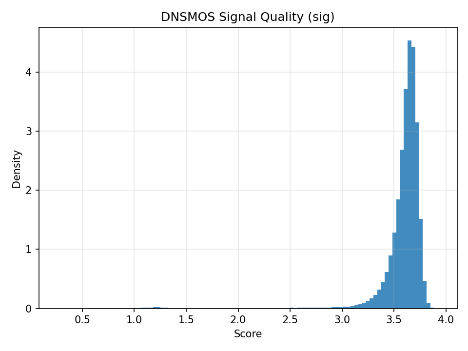

# 🗣️ Audio Dereverberation with Conv‑TasNet

> End‑to‑end, time‑domain speech dereverberation at 16 kHz using a Conv‑TasNet‑style separator with dilated TCN blocks and SI‑SDR training.


> ⚠️ **Project status: Active development**  
> This repository is a work in progress. Interfaces, file paths, and results may change without notice until the first stable release.

## Table of Contents
- [Overview](#overview)
- [Model Architecture](#model-architecture)
- [Loss & Metrics](#loss--metrics)
- [Repository Layout](#repository-layout)
- [Installation](#installation)
- [Data](#data)
- [Training](#training)
- [Results](#results)
- [Roadmap](#roadmap)
- [Citations](#citations)
- [License](#license)
- [Ethics & Intended Use](#ethics--intended-use)

---

## Overview

This repo trains a **single‑channel speech dereverberation** model directly in the **time domain**. It follows the Conv‑TasNet idea: learn an analysis filterbank, enhance with stacked dilated temporal convolution (TCN) blocks, then resynthesize via a synthesis filterbank. Conv‑TasNet has proven highly effective for time‑domain source separation, and the same mechanics transfer to dereverberation.

**Key features**
- **Time‑domain** end‑to‑end training (no STFT required)
- **Dilated TCN** separator with residual connections
- **Negative SI‑SDR** training objective
- Mixed precision (AMP) and optional **8‑bit Adam/AdamW** (bitsandbytes) to cut optimizer memory
- Simple dataset interface for paired *(reverb, clean)* audio segments

---

## Model Architecture

**High level**
1. **Encoder (Conv1d):** learned analysis filterbank  
2. **Separator (TCN stacks):** repeated blocks  
   - 1×1 bottleneck → **depth‑wise dilated Conv1d** (increasing dilation per layer) → **PReLU** → **Global Channel LayerNorm** → 1×1 point‑wise  
   - residual connection and mask estimation
3. **Masking:** element‑wise masks (sigmoid) on encoded mixture
4. **Decoder (ConvTranspose1d):** overlap‑add synthesis back to waveform

**Default hyper‑parameters (baseline)**
```python
num_sources=1
encoder_kernel_size=16      # L
encoder_stride=8            # 50% overlap (L/2)
encoder_filters=512         # N
tcn_hidden=128              # B
tcn_kernel_size=3
tcn_layers=8                # per stack (dilations 1..128)
tcn_stacks=3                # number of repeats
causal=False
```

## Loss & Metrics

### Training Loss — Negative SI‑SDR

We minimize the **negative Scale-Invariant Signal-to-Distortion Ratio (SI‑SDR)** between the predicted enhanced waveform `ŝ` and the clean target `s`.

**SI-SDR formula:**

**SI‑SDR(ŝ, s)** = 10 · log₁₀ ( ‖α · s‖² / ‖ŝ − α · s‖² )  
  where α = ⟨ŝ, s⟩ / ‖s‖²


**Loss function:**

L = − mean_batch[SI‑SDR(ŝ, s)]


This is implemented using **TorchMetrics**’ `ScaleInvariantSignalDistortionRatio` class.

#### Optional: Clipping Penalty

An optional **amplitude clipping penalty** (off by default) discourages values of `|ŝ| > 1`.  
This helps prevent excessive distortion in the generated output.

---

### Validation Metric

- **SI‑SDR (in dB)** — Higher is better.
- Optionally, metrics like **PESQ** or **STOI** can be added if ground-truth references are available.


## Repository Layout

```
├── checkpoints_v1/           # Checkpoints for model V1
├── checkpoints_v2/           # Checkpoints for model V2
├── checkpoints_v3/           # Checkpoints for model V3 
├── out/                      # outputs
├── src/                      # Source code: model, training script, etc.
│   ├── model.py
│   ├── train.py
│   ├── dereverb.py
│   └── (other utils)
├── .gitattributes            
├── .gitignore                
├── LICENSE                   
├── README.md                 
└── requirements.txt          

```
## Installation

# Python 3.10+ recommended
pip install -r requirements.txt

## Data

This project trains on **paired reverberant-clean speech audio**, where each sample is a 10-second mono waveform pair:

- **Reverberant input** (`x`) — artificially reverberated speech  
- **Clean target** (`s`) — the original dry (clean) speech

### Source

Clean speech recordings were sourced from the **[LibriVox Project](https://librivox.org/)** — a public domain collection of audiobooks read by volunteers.  
LibriVox offers diverse accents, speaker styles, and recording conditions, providing a rich set of high-quality voice data.

### Data Processing
- All audio is converted to **mono**, sampled at **16 kHz**, and segmented into **10-second chunks** in **WAV**
- Original audio had its quality measured by using **DNSMOS** with the results shown below.
<p align="center">
  
  
  
  
</p>

- Any clip that did not meet the quality thresholds—**P808 < 3.5, SIG < 3.55, BAK < 4.0, or OVRL < 3.2**—was discarded. The score distributions after filtering are shown below.
<p align="center">
  
  
  
  
</p>

- Few clips that had peaks were also discarded. 
- Remaining audio clips were scaled up right before the point of peaking.
- Audio clips remaining after the processing above was **1,830 hours** in total.

### Reverberation Augmentation

To simulate real-world reverberant environments, each clean audio file was **convolved with room impulse responses (RIRs)** from the  
**[OpenAIR database](https://www.openair.hosted.york.ac.uk/)** — a curated collection of acoustically measured spaces.

## Training

Main knobs live at the top of `src/train.py`:

```
NUM_EPOCHS=10
BATCH_SIZE=6
LR=1e-4
SUBSET=0.01          # fraction of dataset sampled per epoch
REVERB_DIRS=[...]
CLEAN_DIR="..."
```
## Results 

*Fill this once training is complete.*

| Model (16 kHz)                | Parameters | Train Data   | Validation SI‑SDR ↑ |
|------------------------------|------------|--------------|----------------------|
| Conv‑TasNet (512‑128, 3×8)   | ~8 M       | YourDataset  | XX.X dB              |
| Larger (1024‑512, 7×8)       | ~35 M      | YourDataset  | YY.Y dB              |


## Roadmap

- [ ] Add multi‑resolution STFT auxiliary loss
- [ ] Add PESQ/STOI evaluation metrics
- [ ] Implement causal (streaming) variant
- [ ] Optional: support DeepSpeed ZeRO / FSDP for larger models

---

## Citations

### Conv‑TasNet (architecture inspiration)  
Y. Luo, N. Mesgarani. *Conv‑TasNet: Surpassing Ideal Time‑Frequency Magnitude Estimation for Speech Separation*, IEEE/ACM TASLP, 2019.  
[https://arxiv.org/abs/1809.07454](https://arxiv.org/abs/1809.07454)

### SI‑SDR (objective/metric)  
J. Le Roux, S. Wisdom, H. Erdogan, J. R. Hershey. *SDR – Half‑Baked or Well Done?*, ICASSP 2019.  
[https://arxiv.org/abs/1811.02508](https://arxiv.org/abs/1811.02508)

### TorchMetrics: SI‑SDR implementation  
[https://torchmetrics.readthedocs.io/en/stable/audio/scale_invariant_signal_distortion_ratio.html](https://torchmetrics.readthedocs.io/en/stable/audio/scale_invariant_signal_distortion_ratio.html)

### DNSMOS (non-intrusive speech-quality metric)
C. K. A. Reddy, V. Gopal, R. Cutler. DNSMOS: A Non-Intrusive Perceptual Objective Speech Quality Metric to Evaluate Noise Suppressors, 
arXiv preprint arXiv:2010.15258, 2020.
[https://arxiv.org/abs/2010.15258](https://arxiv.org/abs/2010.15258)

### PyTorch AMP (mixed precision)  
[https://pytorch.org/docs/stable/amp.html](https://pytorch.org/docs/stable/amp.html)

### bitsandbytes (optional 8‑bit optimizers)  
[https://github.com/TimDettmers/bitsandbytes](https://github.com/TimDettmers/bitsandbytes)

## License

MIT — see [LICENSE](./LICENSE).

---

## Ethics & Intended Use

This project is intended for **speech quality enhancement**, such as:

- Removing room reverberation from your own recordings
- Improving accessibility
- Enhancing teleconferencing audio

❗ **Please do not** deploy models to circumvent privacy or safety measures, such as:

- Undoing intentional obfuscation (e.g., face blurring or audio masking)
- Processing third-party media without consent


